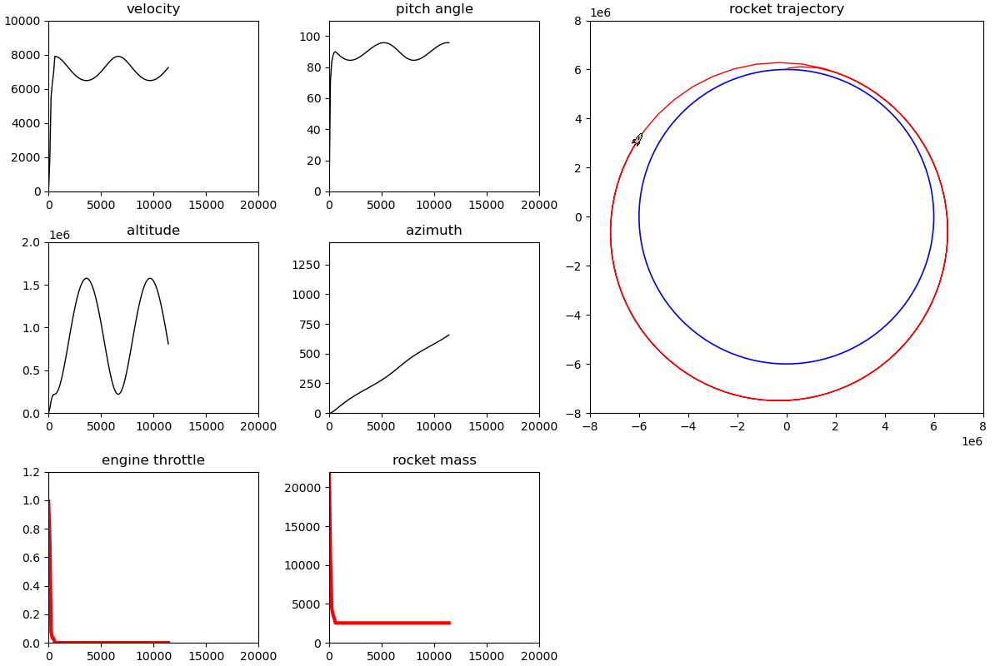

# Rocket
Rocket launch simulation using a gravity turn maneuver using differential equations as described by Mintoc https://mintoc.de/index.php/Gravity_Turn_Maneuver (see below for further explanation). 
The Casadi solution is based on the code given in https://mintoc.de/index.php/Gravity_Turn_Maneuver_(Casadi), updated by Mirko Hahn in the github repository https://github.com/zegkljan/kos-stuff/tree/master/non-kos-tools/gturn. 
After setting up the environemnt, run the programs as follows:

Calculation of the thrust control:
```
python rocket_casadi_solution.py mintoc_20T_1.cfg
```
This program will create an excel trhust contril file as defined in the config file. Then run the launch program using this thrust control solution
```
python rocket_launch.py mintoc_20T_1.cfg
```
Where the configuration file `mintoc_20T_1.cfg` is
```
# parameter must be given in this order
rocket dry mass (kg)           m_dry  : 2_000
rocket fuel mass (kg)          m_fuel : 20_000
motor impulse (s) zero alt     Isp0   : 450
motor impulse (s) vacuum       Isp1   : 450
maximum thrust (N)             Fmax   : 600_000
rocket reference area (m^2)    A      : 3.5
initial velocity (m / s)       vel    : 1e-3
initial flight angle (radians) beta   : 0.000274
initial altitude (m)           h      : 0
gravity at zero altitude       g0     : 9.81
radius at altitude zero        r0     : 6_000_000
drag coefficient (_)           cd     : 0.75
scale height (m)               H      : 8_500
density at zero altitude       rho    : 1.2230948554874
number of shooting intervals   N      : 300
altitude objective (m)         h_obj  : 200_000
velocity objective (m/s)       v_obj  : 8_000
beta objective (degrees)       q_obj  : 90
control file (.xlsx)                  : mintoc_gravity_turn_20T_1.xlsx
time interval (s)  1.1268             : 1
status_update_step                    : 120
duration (s)                          : 20_000
speed min_max (m/s)                   : 0, 10_000
flight angle min max (degrees)        : 0, 110
altitude min max (m)                  : 0, 2_000_000
h_range min max (degrees)             : 0, 1440
acceleration min max (m*s-2)          : -100, 170
rocket sprite file                    : rocket_sprite2.png
```
The code is tested for Python 3.10. 

Once the program starts it gives main parameters in the console and a display of graphs and trajectory.



# Gravity turn
The gravity turn or zero lift turn is a common maneuver used to launch spacecraft into orbit from bodies that have non-negligible atmospheres. The goal of the maneuver is to minimize atmospheric drag by always orienting the vehicle along the velocity vector. In this maneuver, the vehicle's pitch is determined solely by the change of the velocity vector through gravitational acceleration and thrust. The goal is to find a launch configuration and thrust control strategy that achieves a specific orbit with minimal fuel consumption. 
